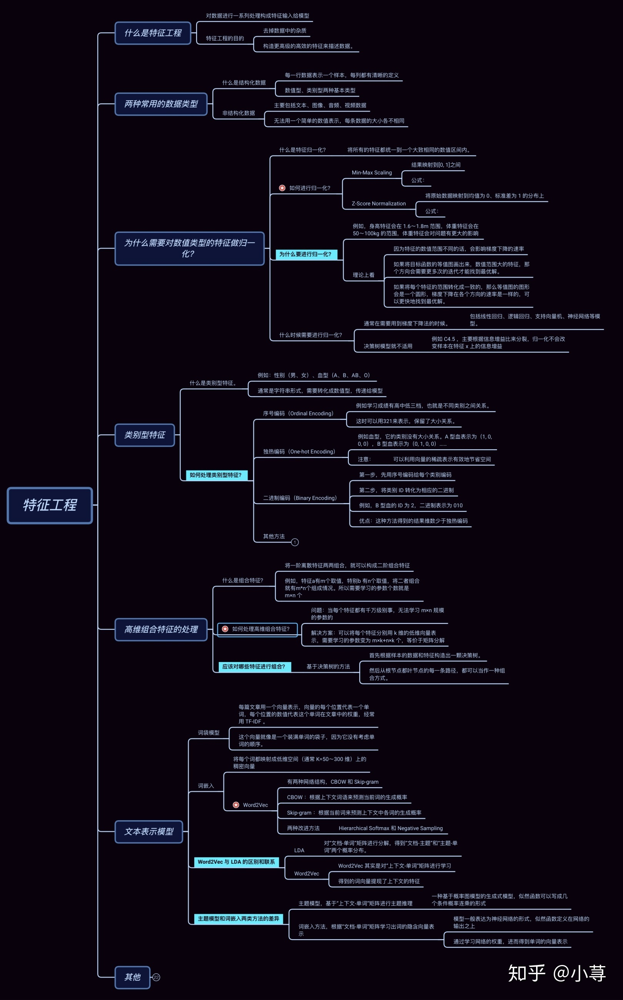

## Q1: 为什么对于特征做归一化？

* 假使计算中使用欧式距离，不同维度量纲不同可能会导致距离的计算依赖于量纲较大的那些特征而得到不合理的结果。
* 在使用梯度下降的方法求解最优化问题时， 归一化/标准化后可以加快梯度下降的求解速度。

## Q2: 特征的类型以及编码方式？

* 类别编码："学士"、"硕士"、"博士" 可以很自然地编码成[0，1，2]
* 序号编码：”高“，”中“，”低“，可以很自然地编码成[2，1，0]，存在顺序
* 独热编码：这种稀疏编码需要注意：1.使用稀疏的向量表示节省空间。2.配合特征选择降维。

## Q3: 缺失值的处理方式？

通常遇到缺值的情况，我们会有几种常见的处理方式

如果缺值的样本占总数比例极高，我们可能就直接舍弃了，作为特征加入的话，可能反倒带入noise，影响最后的结果了如果缺值的样本适中，而该属性非连续值特征属性(比如说类目属性)，那就把NaN作为一个新类别，加到类别特征中如果缺值的样本适中，而该属性为连续值特征属性，有时候我们会考虑给定一个step(比如这里的age，我们可以考虑每隔2/3岁为一个步长)，然后把它离散化，之后把NaN作为一个type加到属性类目中

## Q4: 哪些特征可以有效组合？组合特征维度过高要怎么办？

* 可以根据决策树路径来构建特征组合。
* 组合NxM个特征，可以用矩阵分解。

## Q5: 连续特征的离散化：特征离散化之后可以获得更好的效果？

* 离散化后的特征对异常数据有很强的鲁棒性：比如一个特征是年龄>30是1，否则0。如果特征没有离散化，一个异常数据“年龄300岁”会给模型造成很大的干扰；
* 具体来说，离散化后可以进行特征组合，由M+N个变量变为M*N个变量；
* 提高计算速度。稀疏向量内积乘法运算速度快，计算结果方便存储。

## Q6: 在训练的过程当中，如果有很多的特征高度相关，或者说有一个特征重复了100遍，会造成怎样的影响？

先说结论，如果在损失函数最终收敛的情况下，其实就算有很多特征高度相关也不会影响分类器的效果。可以认为这100个特征和原来那一个特征扮演的效果一样，只是可能中间很多特征的值正负相消了。

为什么我们还是会在训练的过程当中将高度相关的特征去掉？

* 去掉高度相关的特征会让模型的可解释性更好,可以大大提高训练的速度。
* 如果模型当中有很多特征高度相关的话，就算损失函数本身收敛了，但实际上参数是没有收敛的，这样会拉低训练的速度。

