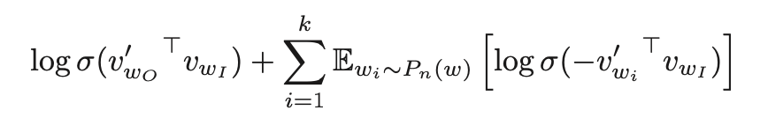
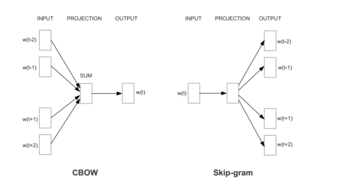

## 有哪些文本表示模型？

* 词袋模型与N-gram模型

最基础的文本表示模型是词袋模型：就是将每篇文章看成一袋子词，并忽略每个词出现的顺序。具体来说，就是将整段文本以词为单位切分开，然后每篇文章可表示成一个一个长向量，向量中的每一维代表一个单词，而该维对应的权重则反映了这个词在原文章中的重要程度。常用TF-IDF来计算权重，公式为 TF(t,d)*IDF(t),其中TF（t，d）为单词t在文档d中出现的频率，IDF（t）是逆文档频率，用来衡量单词t对表达语义所起的重要性，表示为log(文章总数/（包含单词的文章总数+1)）。通常，可以将连续出现的n个词（n≤N）组成的词组（N-gram）也作为一个单独的特征放到向量表示中去，构成N-gram模型。

* 词嵌入模型：Word2Vec模型与Bert模型。

## Word2Vec模型有哪些？

Skip-gram 即 预测一个词的上下文；CBOW 即 基于上下文来预测上下文中间缺的词。

区别是CBOW使用中心词来调整周围词的embedding，对于高频词表示的更好，同时速度快。而Skip-gram是用周围词来调整中心词的embedding，每个词在作为中心词的时候，都要进行K次的预测、调整。因此， 当数据量较少，或者词为生僻词出现次数较少时， 这种多次的调整会使得词向量相对的更加准确。

Skip-gram 有层次化softmax 和 负采样两种优化速度的方式。

层次化softmax是根据 词频构建哈弗曼树，对于将每个节点设置为sigmoid。
负采样 是把多分类转化为二分类，对于一个中心样本，构建一个正样本【周围样本】和多个负样本【随机采样，频率大的样本概率高】来构建损失。如下公式

具体实现：其基本思想是 通过训练将每个词映射成 K 维实数向量（K 一般为模型中的超参数），通过词之间的距离（比如 cosine 相似度、欧氏距离等）来判断它们之间的语义相似度.其采用一个 三层的神经网络 ，输入层-隐层-输出层。训练出两个NxK矩阵，选择一个作为词向量表示矩阵。

参考：https://zhuanlan.zhihu.com/p/29119732